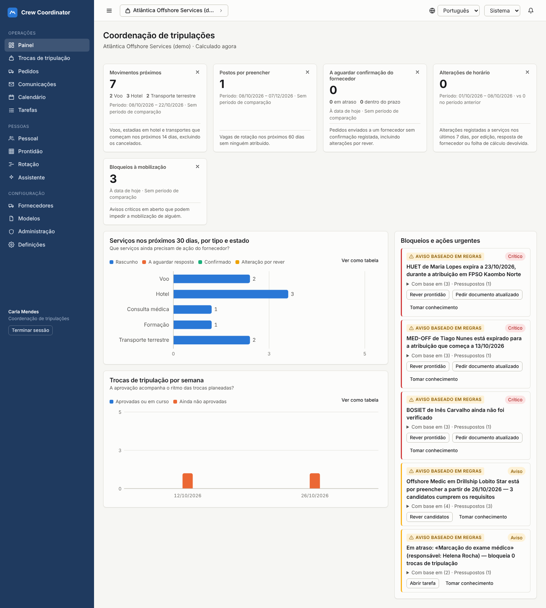

# Crew Coordinator

> Enter operational information once, generate the required spreadsheets and emails, and track every
> arrangement from request to confirmed execution.

Crew Coordinator is a multi-tenant platform for offshore crew mobilisation. The database is the internal
source of truth; **email remains the main external channel** and **Excel remains the external
deliverable**. Coordinators select a crew change, and the platform:

- generates provider-specific XLSX attachments and emails from the records;
- routes them through review;
- sends them through the organisation's own mailbox;
- associates replies;
- extracts proposed changes for human validation;
- reconciles spreadsheets suppliers send back;
- flags downstream impacts, such as a changed flight that affects a hotel and a transfer.

The interface is fully bilingual (European Portuguese and English).



## Status: what this release is, and what it is not

| Area | State |
|---|---|
| Server (API, database, security model, email/Excel workflow, intelligence) | Implemented and covered by **97 automated tests**, including a 20-step operational acceptance test |
| Web application (pt-PT / en, light / dark, desktop / mobile) | Implemented. **6 browser tests** sign in through the IdP, exercise the main screens in both languages and run axe (WCAG 2.1 AA): no serious or critical violations |
| Microsoft 365 / Outlook connector (Graph) | Implemented and tested against a local fake of the Graph API. **Not yet verified against a live Microsoft 365 tenant.** |
| Google Workspace / Gmail connector | **Not available in this release** and labelled as such in the UI |
| Identity provider | OIDC client implemented and tested against a development IdP. A Keycloak realm export is included but **was not run in the build environment** |
| Malware scanning | ClamAV (clamd) integration implemented; **not exercised against a live clamd**. Without a scanner, uploads stay quarantined |
| AI assistant | Scoped retrieval implemented and tested. The Claude call is tested against a fake endpoint. **Off by default**: an administrator must approve a provider |

Nothing in this repository claims the system is "100% secure". [docs/SECURITY.md](docs/SECURITY.md)
lists the implemented controls, the evidence for each, and the risks that remain open.

## Documentation

| Document | Contents |
|---|---|
| [docs/ARCHITECTURE.md](docs/ARCHITECTURE.md) | Components, data model, request flow, email/Excel pipeline, intelligence engine |
| [docs/SECURITY.md](docs/SECURITY.md) | Controls by layer, verification evidence, unresolved risks |
| [docs/ACCEPTANCE.md](docs/ACCEPTANCE.md) | Each acceptance criterion mapped to the tests that demonstrate it, with results |
| [docs/DESIGN_AND_ACCESSIBILITY.md](docs/DESIGN_AND_ACCESSIBILITY.md) | Visual system, chart rules, palette validation, accessibility results |
| [docs/INCIDENT_RESPONSE.md](docs/INCIDENT_RESPONSE.md) | Alert handling and the incident procedure |
| [docs/DATA_RETENTION.md](docs/DATA_RETENTION.md) | Retention, deletion and backup policy |

## Quick start (local development)

Requirements: Node.js 22+ and PostgreSQL 16.

```bash
npm install
cp .env.example .env                 # defaults work for local development
npm run migrate                      # creates tables, row-level security and the runtime DB role
npm run seed -- --reset              # fictional demonstration data (two organisations)

# three terminals:
npm run dev-idp --workspace server   # development OIDC provider on :4000 (refuses to run in production)
npm run dev --workspace server       # API on :3000
npm run dev --workspace web          # web app on :5173 (proxies /api and /auth)
```

Open http://localhost:5173 and sign in with the development IdP. It has no passwords: you pick an
identity and the authentication method to simulate (password only, password + OTP, security key), so
MFA and step-up enforcement can be tried.

| Identity | Role | Notes |
|---|---|---|
| ana.ferreira@atlantica.example | Administrator | |
| rui.costa@atlantica.example | Management | Approves crew changes and email packages |
| carla.mendes@atlantica.example | Crew coordination | Prepares and sends packages |
| pedro.santos@atlantica.example | Crew coordination | Scoped to the drillship only |
| helena.rocha@atlantica.example | HR and compliance | Sees medical records |
| joao.silva@atlantica.example | Employee | Sees only their own records |
| bookings@transafrica-travel.example | Supplier | Sees only their own requests |
| sofia.almeida@consult.example | Member of **two** organisations | Must choose a workspace |
| bob.martins@kwanza.example | Administrator of the second organisation | |
| nuno.pires@atlantica.example | Not registered | Use an invitation |

Privileged roles must sign in with OTP or a security key. With password only they are stopped
before any data is shown.

Without a connected mailbox the app runs in **demonstration mode**: packages can be reviewed, approved
and downloaded (.eml and .xlsx), but nothing is sent or recorded as sent.

## Tests

```bash
npm test --workspace server   # 97 tests: auth, tenancy, access control, concurrency, XLSX, extraction, workflow, dashboards, AI, audit
npm test --workspace web      # translation parity (keys, placeholders, untranslated strings)
npx playwright test -c web/playwright.config.ts   # browser + axe; needs the local stack running with demo data
```

The server tests create a fresh `crew_coordinator_test` database, start a test IdP and fake Graph and
Claude endpoints on local ports, and drive the real OIDC authorization-code + PKCE flow.

## Production notes

- Build with the provided `Dockerfile`. The API serves the web build from the same origin.
- Required: HTTPS, a maintained OIDC IdP with MFA (and preferably WebAuthn), `TOKEN_ENCRYPTION_KEY`
  and `URL_SIGNING_KEY` from a secret manager, a database connection as a role without `BYPASSRLS`,
  encrypted storage for `STORAGE_DIR`, and ClamAV.
- Run the background worker (`npm run worker --workspace server`) for sending retries, Sent Items
  reconciliation, reminders, mailbox synchronisation and insight refresh.
